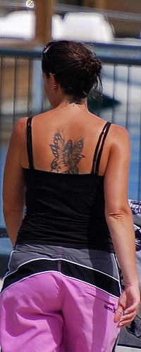
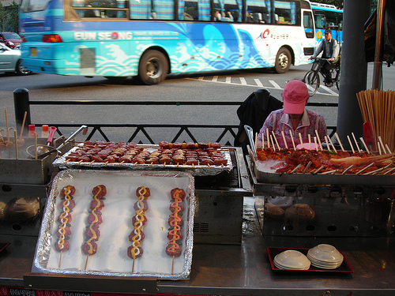
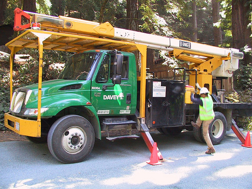
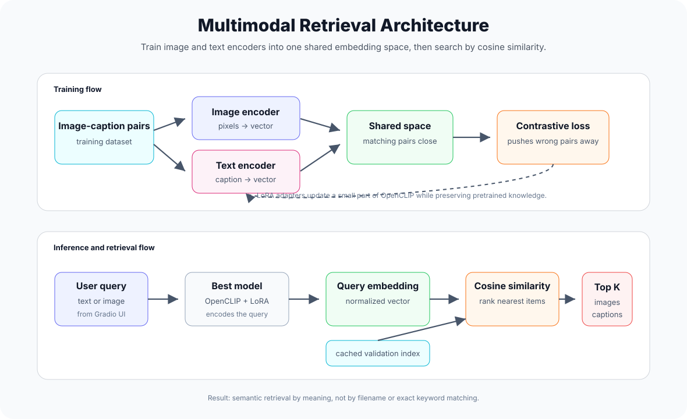
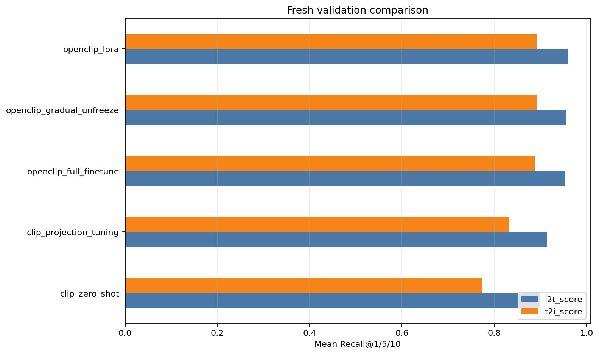

# Multimodal Image-Text Retrieval

This project builds a small but complete image-text retrieval system: give it a sentence and it finds matching images; give it an image and it retrieves the most relevant captions.

The core idea is simple and powerful. Images and text are different kinds of data, but CLIP-style models learn to place both of them inside the same embedding space. In that space, a photo of a dog running through snow and the sentence `a dog running through snow` should land close together. Retrieval then becomes a nearest-neighbor search: encode the query, compare it with stored embeddings, and return the closest matches.

This folder is the cleaned, GitHub-ready version of the work. The original notebooks and experiment files were left untouched; this directory adds a polished visual notebook, a resumable training pipeline, final comparison results, and an interactive UI for the best model.

## Visual Preview

A few validation images from the retrieval collection are shown below. These are the kind of images the trained system searches through when you type a text query in the UI.

<table>
  <tr>
    <td align="center"><br><sub>Validation image sample 1</sub></td>
    <td align="center"><br><sub>Validation image sample 2</sub></td>
    <td align="center"><br><sub>Validation image sample 3</sub></td>
    <td align="center"><br><sub>Validation image sample 4</sub></td>
  </tr>
</table>

The goal is not to memorize these images by filename. The goal is to understand them semantically. If the query says `a person riding a bike`, the model should retrieve images that mean that, even if the filename contains only a number.

## Architecture: How It Works



The system has two connected phases:

1. Training: image-caption pairs are passed through image and text encoders. A contrastive loss pulls correct pairs closer and pushes incorrect pairs apart. In the best model, LoRA adapters fine-tune OpenCLIP efficiently without updating the whole network.
2. Retrieval: validation images and captions are encoded once and cached. When a user searches, only the new query is encoded. The app compares that query embedding against the cached index and returns the closest matches.

## What This Project Does

The project answers one main question:

> How well can different CLIP/OpenCLIP fine-tuning strategies align images and captions for retrieval?

It supports two retrieval directions:

- Text to image: type a natural-language query and retrieve the most visually relevant validation images.
- Image to text: upload or select an image and retrieve captions that best describe it.

The final system is not just a training notebook. It includes:

- a reproducible experiment suite,
- resumable training after crashes,
- multiple model strategies,
- validation metrics for both retrieval directions,
- a visual story notebook with saved outputs,
- and a Gradio UI for using the best trained model.

## The Intuition

Think of the model as learning a shared map.

On one side, an image encoder looks at pixels and creates a vector. On the other side, a text encoder reads a caption and creates another vector. During training, the model is rewarded when matching image-caption pairs move closer together and mismatched pairs move farther apart.

For example:

```text
Image:   a child playing with a red ball
Caption: "a young child plays with a red ball outside"
```

The model does not compare raw pixels with raw words. Instead, it converts both into embeddings:

```text
image -> image embedding
text  -> text embedding
```

Then it uses cosine similarity:

```text
higher similarity = more likely to match
lower similarity  = less likely to match
```

So when you type a query in the UI, this happens:

1. The text query is tokenized.
2. The text encoder converts it into an embedding.
3. All validation images already have cached embeddings.
4. The app computes similarity between your query and every image embedding.
5. The top scoring images are returned in ranked order.

For image-to-caption retrieval, the same idea is flipped:

1. The uploaded image is preprocessed.
2. The image encoder converts it into an embedding.
3. Validation captions already have cached text embeddings.
4. The app compares the image against all caption embeddings.
5. The closest captions are returned.

That is the whole trick: once images and text live in the same vector space, retrieval becomes fast and intuitive.

## Models Compared

Five strategies were trained or evaluated under the same validation setup.

| Experiment | What It Means | Why It Matters |
|---|---|---|
| `clip_zero_shot` | Uses the pretrained model without fine-tuning | Baseline: how good is CLIP before learning this dataset? |
| `clip_projection_tuning` | Trains lightweight projection layers | Cheap adaptation with few trainable parameters |
| `openclip_full_finetune` | Fine-tunes the full OpenCLIP model | Strong but expensive; many parameters update |
| `openclip_gradual_unfreeze` | Starts frozen, then unfreezes more layers | More controlled full-model adaptation |
| `openclip_lora` | Adds small trainable LoRA adapters | Parameter-efficient fine-tuning with strong performance |

The most useful comparison here is not only accuracy. It is accuracy versus training cost. A model that scores slightly higher while training far fewer parameters is often the better engineering choice.

## Final Result

The models were retrained using the resumable experiment suite and evaluated on the same validation split.



| Rank | Experiment | Mean Score | Image-to-Text | Text-to-Image | Trainable Params |
|---:|---|---:|---:|---:|---:|
| 1 | `openclip_lora` | 0.9264 | 0.9600 | 0.8929 | 1,228,801 |
| 2 | `openclip_gradual_unfreeze` | 0.9232 | 0.9581 | 0.8883 | 149,620,737 |
| 3 | `openclip_full_finetune` | 0.9211 | 0.9576 | 0.8845 | 149,620,737 |
| 4 | `clip_projection_tuning` | 0.8739 | 0.8933 | 0.8546 | 657,921 |
| 5 | `clip_zero_shot` | 0.8361 | 0.8361 | 0.8361 | 0 |

The best model is `openclip_lora`.

It wins for a very practical reason: it gives the strongest mean validation score while training only about 1.23 million parameters. The full fine-tuning models train about 149.6 million parameters, but still score slightly lower. That makes LoRA the best tradeoff in this project: strong retrieval quality, much lower training cost, and easier reuse.

## How The Best Model Retrieves Results

The demo app uses the trained `openclip_lora` checkpoint.

When the app starts, it builds or loads a validation index:

```text
validation images   -> image embeddings
validation captions -> text embeddings
```

Those embeddings are cached in:

```text
artifacts/fresh_runs/demo_validation_index.pt
```

After that, searching is quick because the model does not need to re-encode the whole dataset every time. It only encodes your new query and compares it against the cached embeddings.

For a text query:

```text
"a man riding a bicycle"
```

The app computes:

```text
similarity(query_text_embedding, every_image_embedding)
```

Then it displays the highest scoring images.

For an uploaded image, it computes:

```text
similarity(uploaded_image_embedding, every_caption_embedding)
```

Then it displays the highest scoring captions.

This is why the UI can feel like semantic search instead of filename search. It is not looking for exact words in a file name. It is searching by meaning in the learned embedding space.

## Project Files

| File | Purpose |
|---|---|
| `visual_story.ipynb` | Main presentation notebook with explanation, plots, examples, outputs, and final comparison |
| `app.py` | Gradio UI for using the best trained model interactively |
| `PROJECT_REPORT.md` | Short report-style summary of the project and results |
| `train_all_models_resumable.ipynb` | Notebook for retraining all experiments from scratch |
| `resumable_experiments.py` | Shared training, checkpointing, evaluation, and comparison code |
| `unified_multimodal_retrieval.ipynb` | Earlier unified notebook kept as reference |
| `experiment_audit.md` | Audit of the original notebooks and completed runs |
| `requirements.txt` | Required Python packages |
| `assets/fresh_comparison.png` | Final comparison chart used in the notebook and README |
| `assets/retrieval_architecture.svg` | Generated architecture diagram for the README |
| `assets/sample_*.jpg` | Small validation-image preview gallery used in the README |

## Start Here

For the best reading experience, open:

```text
visual_story.ipynb
```

That notebook is meant to tell the project like a visual story: problem, intuition, dataset examples, model choices, results, demo retrievals, and conclusion.

For a short written summary, open:

```text
PROJECT_REPORT.md
```

For the interactive demo, run:

```bash
cd /home/student/Deep-Mtech/misc/DL/merged_multimodal_retrieval
pip install -r requirements.txt
python app.py
```

The UI will open a local Gradio app. It has two tabs:

- Text to Images: enter a prompt and retrieve matching validation images.
- Image to Captions: upload an image and retrieve matching captions.

## Reproducing The Training

To retrain all models, open:

```bash
cd /home/student/Deep-Mtech/misc/DL/merged_multimodal_retrieval
jupyter lab train_all_models_resumable.ipynb
```

The training pipeline is designed to survive crashes. If the kernel stops midway, rerun the notebook and call:

```python
comparison = suite.run_all()
display(comparison)
```

Completed experiments are skipped. Incomplete experiments resume from the latest saved checkpoint.

Checkpoints and metrics are saved under:

```text
artifacts/fresh_runs/
```

## Metrics Used

The final comparison reports three main scores:

| Metric | Meaning |
|---|---|
| Image-to-Text | Given an image, how well does the model retrieve the correct/relevant caption? |
| Text-to-Image | Given a caption/query, how well does the model retrieve the correct/relevant image? |
| Mean Score | Average of both retrieval directions |

Using both directions matters because a model can be stronger in one direction than the other. A good multimodal retrieval system should align the space both ways.

## Why LoRA Was The Final Choice

LoRA was selected because it gave the best balance of quality and efficiency.

Full fine-tuning updates the entire model, which is powerful but heavy. LoRA keeps the pretrained model mostly intact and learns small adapter updates. That means it can adapt to the dataset without disturbing all of the pretrained knowledge.

In this project, that worked very well:

```text
openclip_lora mean score:       0.9264
full fine-tune mean score:      0.9211
LoRA trainable parameters:      1.23M
full fine-tune parameters:      149.62M
```

So the final model is not just the top scorer. It is also the more elegant engineering solution.

## Notes

- The original notebooks and folders in `misc/DL` were not modified.
- The dataset is expected at `../data` relative to this folder.
- The UI searches the validation set, so it is a project demo, not a general web image search engine.
- Large generated artifacts are kept under `artifacts/`, which is intentionally ignored by Git except for lightweight summaries and charts.

## In One Sentence

This project fine-tunes CLIP/OpenCLIP models so that images and captions meet in the same semantic space, then uses that space to retrieve the most meaningful matches in either direction.
